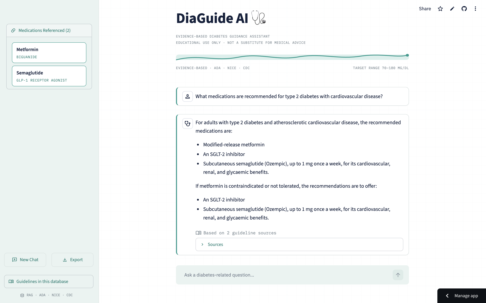

# DiaGuide AI 🩺

**An evidence-based diabetes guidance assistant built with Retrieval-Augmented Generation (RAG).**

[](https://diaguide-ai.streamlit.app)
[](https://github.com/smulamalla/diaguide-ai)


DiaGuide AI answers diabetes-related questions using only content retrieved from real clinical guidelines—the ADA Standards of Care, NICE guidance, and CDC statistics—rather than relying on the language model's parametric knowledge. Every answer is grounded in retrieved guideline text and returned with transparent citations to the original source.

> ⚠️ **Educational tool only.** DiaGuide AI is a portfolio/demo project and is **not** a substitute for professional medical advice, diagnosis, or treatment.


*Clinical-style interface featuring grounded answers, transparent citations, medication extraction, and persistent conversation history.*

---

## Highlights

- 📚 Evidence-grounded Retrieval-Augmented Generation (RAG)
- 💬 Conversation-aware follow-up questions
- 📖 Transparent citations with page-level references
- 💊 Automatic medication extraction and drug classification
- 🧠 Out-of-scope detection to prevent hallucinations
- 💾 Persistent conversations with Markdown export

## Why this project

Most "chat with your PDFs" demos stop at retrieval + generation. DiaGuide AI is built to reflect what an evidence-based clinical tool actually needs: grounded answers, transparent citations, scope control, and a UI that doesn't look like a weekend hackathon project. It started from the [pixegami LangChain RAG tutorial](https://github.com/pixegami/langchain-rag-tutorial) and was extended significantly beyond it — see [Acknowledgments](#acknowledgments).

## Features

- **Grounded RAG pipeline** — answers are generated only from retrieved guideline text; the model is instructed to refuse rather than guess when context is insufficient.
- **Scope detection** — an LLM classification step rejects clearly non-diabetes questions before retrieval runs.
- **Conversation memory** — follow-up questions ("what about for kidney disease?") are rewritten into standalone questions using recent chat history before retrieval.
- **Better retrieval** — Maximal Marginal Relevance (MMR) search reduces redundant near-duplicate chunks, plus a similarity-score cutoff that rejects weak matches instead of forcing an answer from loosely related content.
- **Source citations** — every answer links back to its guideline, page numbers, and full citation, grouped and deduplicated across chunks.
- **Retrieval drug panel** — medications mentioned in an answer are automatically detected and displayed as a structured side reference with drug class.
- **Guideline version display** — a sidebar panel lists every guideline in the database with its version and a staleness flag if it may need updating.
- **Suggested questions** — a starter set of example questions for first-time users.
- **Save & export chat history** — conversations persist across a page refresh (via session ID in the URL) and can be exported as a Markdown transcript.
- **Custom UI** — a theme built around a continuous-glucose-monitor visual motif (IBM Plex type family, glucose-trace header divider, teal/amber palette drawn from CGM "in range"/"high" color conventions).

## Tech stack


| Layer | Tool |
|---|---|
| Orchestration | LangChain |
| LLM | OpenAI GPT-4o-mini |
| Embeddings | OpenAI Embeddings |
| Vector store | Chroma |
| UI | Streamlit |
| PDF parsing | PyPDFLoader |

## Guideline sources

| Organization | Document | Version |
|---|---|---|
| American Diabetes Association | Standards of Care in Diabetes—2026 | 2026 |
| National Institute for Health and Care Excellence (NICE) | Type 2 Diabetes in Adults: Management | NG28 |
| Centers for Disease Control and Prevention | National Diabetes Statistics Report | 2026 |

Full citation metadata for each source lives in [`data/sources.json`](data/sources.json).

## How it works

**Retrieval pipeline**
```
User question
  → Scope check (in/out of diabetes domain)
  → Condense follow-up into standalone question (using chat history)
  → Retrieve chunks (MMR + similarity-score cutoff) from Chroma
  → Generate answer strictly from retrieved context
  → Extract cited sources + mentioned medications
  → Render answer, sources, and drug panel in Streamlit
```

*(A full architecture diagram is in [`assets/architecture.png`](assets/architecture.png).)*

## Getting started

**1. Clone the repo**
```bash
git clone https://github.com/smulamalla/diaguide-ai.git
cd diaguide-ai
```

**2. Set up your environment**
```bash
python3 -m venv venv
source venv/bin/activate        # Windows: venv\Scripts\activate
pip install -r requirements.txt
```

**3. Add your OpenAI API key**
Create a `.env` file in the project root:
```
OPENAI_API_KEY=your-key-here
```

**4. Build the vector database**
```bash
python create_database.py
```

**5. Run the app**
```bash
streamlit run app.py
```

## Example Questions

Try asking DiaGuide AI questions like:

- What is the target A1C for most adults with type 2 diabetes?
- How should metformin be used in patients with chronic kidney disease?
- When should adults be screened for prediabetes?
- What are the first-line medications for type 2 diabetes?
- What lifestyle changes reduce the risk of diabetes?

### Follow-up Example

**You:** What is the target A1C for most adults with type 2 diabetes?

**DiaGuide AI:** ...

**You:** What about older adults?

The assistant rewrites the follow-up into a standalone question using the conversation history before retrieval, allowing natural multi-turn interactions.
DiaGuide AI will either answer using retrieved guideline evidence with transparent citations or explicitly state when the available guidelines do not contain enough information to answer the question.

## Project structure

```
diaguide-ai/
├── app.py                  # Streamlit chat interface
├── rag_pipeline.py         # Retrieval + generation logic
├── load_documents.py       # PDF loading and chunking
├── create_database.py      # Builds the Chroma vector database
├── drug_reference.py       # Curated drug name → class lookup
├── data/
│   ├── guidelines/          # Source PDFs
│   ├── sources.json         # Guideline metadata & citations
│   └── chat_history/        # Saved conversation sessions
├── chroma/                  # Persisted vector database
├── .streamlit/
│   └── config.toml          # Theme configuration
└── requirements.txt
```

## Limitations

- Answers are only as current and complete as the three guideline documents in the database — this is a portfolio demonstration, not a clinically validated or regulatory-approved tool.
- Chat history persistence relies on local disk storage, which is not guaranteed to survive redeploys on Streamlit Community Cloud's free tier.
- Drug detection uses a curated keyword list, not a comprehensive medical terminology database.

## Acknowledgments

- Built on top of the retrieval pipeline structure from [pixegami/langchain-rag-tutorial](https://github.com/pixegami/langchain-rag-tutorial).
- Guideline content © their respective publishers (ADA, NICE, CDC) — used here for educational/demonstration purposes with full citation.

## License

This project is licensed under the MIT License. See the [LICENSE](LICENSE) file for details.

## Author

**Sohan Mulamalla**

AI / Machine Learning Engineer focused on healthcare applications.

- GitHub: https://github.com/smulamalla
- LinkedIn: https://www.linkedin.com/in/smulamalla/
- Portfolio: https://smulamalla.github.io/